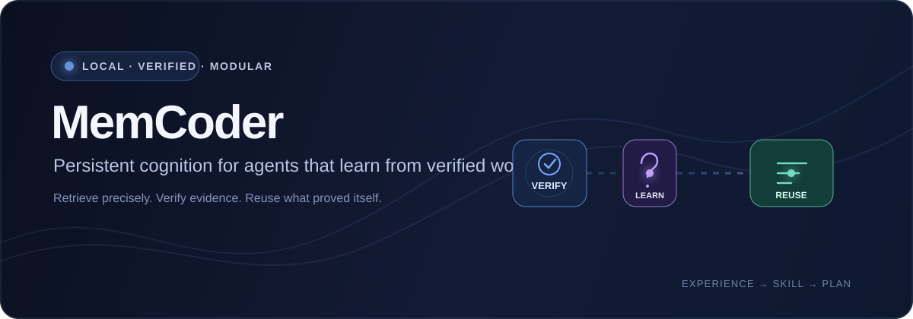
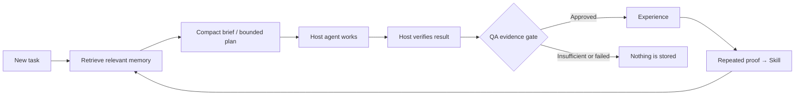

<div align="center">



<p>
  <a href="https://pypi.org/project/memcoder/"></a>
  <a href="https://pypi.org/project/memcoder/"></a>
  <a href="LICENSE"></a>
  <a href="docs/roadmap.md"></a>
</p>

<p>
  <a href="#start-here">Start here</a> ·
  <a href="#how-it-works">How it works</a> ·
  <a href="#connect-a-host">Connect a host</a> ·
  <a href="#trust-and-evidence">Trust & evidence</a> ·
  <a href="docs/roadmap.md">Roadmap</a>
</p>

</div>

> **MemCoder gives AI agents a durable, local memory loop built on verified
> work—not chat history.** It retrieves relevant evidence, protects memory
> quality, turns repeated success into reusable Skills, and offers bounded plans
> without owning your model, tools, or codebase.

## Start here

```powershell
python -m pip install --upgrade memcoder
python -m memcoder --help
```

That is the entire install. You need Python 3.10+ and internet access the first
time MemCoder downloads its local embedding model. You do **not** need an API
key, Ollama, CUDA, or a local generation server.

<details>
<summary>Windows cannot find <code>python</code>?</summary>

Install Python from [python.org](https://www.python.org/downloads/) and select
**Add Python to PATH**. If your installation uses `py`, substitute `py` for
`python` in all commands.

</details>

<details>
<summary>Developing from a checkout?</summary>

```powershell
python -m pip install --no-build-isolation .
```

</details>

## What MemCoder does

<table>
<tr>
<td width="50%" valign="top">

### It handles

- Local Experiences, Mistakes, Reflections, and Principles
- Precision retrieval with confidence and relevance gates
- Evidence quality checks before learning
- Compact, token-bounded cognition briefs
- Evidence-backed Skills and bounded plans
- Plan audit history and derived Skill health
- MCP, CLI, and Python interfaces

</td>
<td width="50%" valign="top">

### Your agent still handles

- Model selection and reasoning
- Reading and editing project files
- Commands, tests, builds, renders, and deployment
- Whether guidance fits the current project
- The final implementation decision

</td>
</tr>
</table>

The boundary is intentional: MemCoder is a cognition layer, not an autonomous
coding agent or a replacement for your application database.

## How it works



```text
Experience → Reflection → Principle → Skill → Plan
```

1. A host asks for guidance before it starts work.
2. MemCoder returns only trusted, relevant evidence in a compact brief.
3. The host investigates, solves, and independently verifies the task.
4. MemCoder accepts learning only when the supplied evidence passes QA.
5. Repeated verified Experiences can support a reusable Skill.

## Use it from any automation

MemCoder works with any host that can run a command or call an MCP tool:
AGY / Antigravity CLI, Gemini or Claude scripts, CI jobs, Python applications,
and custom agent frameworks.

### The universal CLI workflow

**1. Ask for guidance**

`prepare.json`

```json
{
  "problem": "Resolve a required-field validation failure and run the focused test.",
  "agent_id": "billing-api",
  "include_shared": false,
  "detail_level": "brief"
}
```

```bash
memcoder prepare --input prepare.json
```

The response contains a strategy (`normal_reasoning`, `memory_guided`, or
`memory_first`), relevant evidence cards, recommended next action, verification
requirement, and token budget. Give that response to your host as **guidance,
not proof**.

**2. Verify first, then learn**

`record.json`

```json
{
  "task": "Resolved a required-field validation failure.",
  "files": ["src/request_validation.py", "tests/test_request_validation.py"],
  "summary": "The focused test passed after explicit validation was added.",
  "solution": "Validated the required field before processing the request.",
  "evidence": {
    "checks": [{
      "name": "focused request-validation test",
      "kind": "test",
      "status": "passed",
      "command": "python tests/test_request_validation.py",
      "output": "PASS: request validation"
    }]
  },
  "agent_id": "billing-api"
}
```

```bash
memcoder verify --input record.json
memcoder record --input record.json
```

`verify` returns `approved`, `rejected`, or `insufficient_evidence`. `record`
re-runs the same gate, so a host cannot pollute memory merely by claiming that
a task succeeded.

> **Use a stable `agent_id`.** It is a local memory namespace, not a provider
> account. Reuse one label per project—such as `billing-api`—so unrelated work
> never mixes.

### First task vs. later tasks

| First verified task | Later related tasks |
| --- | --- |
| `prepare` usually returns `normal_reasoning`; this is expected. | Relevant approved Experiences and Skills can produce `memory_guided` or `memory_first` support. |
| The host solves and verifies normally. | The host still verifies; memory is a hypothesis, never proof. |
| Record the approved outcome. | Each approved outcome makes later retrieval more useful. |

## Connect a host

### AGY / Antigravity CLI

Configure AGY once, then restart it completely:

```bash
python -m memcoder setup-agy
```

MemCoder adds MCP tools such as `memcoder_prepare`, `memcoder_start`,
`memcoder_verify`, `memcoder_record`, `memcoder_promote_skill`, and
`memcoder_plan_history`.

> No `agy plugin install`, Ollama, API key, or model server is required.

#### Reliable AGY pattern

For reliable tool use, retrieve in a dedicated first interaction. This keeps
host behavior deterministic instead of relying on the model to decide whether
to call a tool halfway through a longer prompt.

<details open>
<summary><strong>Message 1 — retrieve only</strong></summary>

```text
Do not read, list, edit, or run any files or commands.

Call memcoder_prepare exactly once with:
- problem: "<your exact task>"
- agent_id: "my-project"
- include_shared: false

After the tool returns, print the complete result and stop.
```

</details>

<details open>
<summary><strong>Message 2 — work with that guidance</strong></summary>

```text
Use the MemCoder guidance returned immediately above as guidance, not proof.
Do not call any more MemCoder tools.

Work only inside the current folder. Do not inspect or edit MemCoder itself.
Solve the requested task, run its focused verification, and report changed
files and complete test output.
```

</details>

After the host verifies success, call `memcoder_verify` with the actual
evidence. Call `memcoder_record` once only when QA approves it. The reusable
[AGY prompt template](docs/antigravity_prompt_template.md) adds stricter
guardrails for production use.

<details>
<summary>AGY cannot see MemCoder tools?</summary>

Run this in the same Python environment used for setup:

```bash
python -c "from adapters.mcp.server import mcp; print('MemCoder MCP import OK')"
```

If it fails, reinstall MemCoder into that environment and restart AGY.

</details>

### Python and custom hosts

The CLI is JSON in / JSON out and is the simplest integration point for any
host language. Python hosts can also use the public API directly. MCP-capable
hosts use the same underlying cognition flow through tool calls.

See [MCP integration notes](docs/antigravity_mcp.md) and the CLI help for the
complete command surface:

```bash
memcoder --help
```

## Skills and plans

Skills make memory procedural. They are not free-form notes and they do not
execute commands themselves.

| Stage | Guardrail |
| --- | --- |
| **Promote** | Requires two QA-approved supporting Experiences, or one explicitly human-approved Experience. |
| **Retrieve** | A matching Skill is returned ahead of individual Experiences. |
| **Plan** | Plans are bounded, named, and linked to their source Skill. |
| **Audit** | Outcome records create durable plan audits, never task guidance. |
| **Health** | Repeated failures can mark a Skill `review_required` and exclude it from automatic retrieval. |

Promote a reusable procedure:

```bash
memcoder skill promote --input skill.json
```

Retrieve a compact brief and bounded plan in one call:

```bash
memcoder start --input plan.json
```

When no matching Skill exists, MemCoder says so and returns a transparent
foundation plan—it does not pretend to know a procedure it has not learned.

<details>
<summary>View a minimal Skill definition</summary>

```json
{
  "name": "Required field validation",
  "when_to_use": "A required request field may be absent before processing.",
  "inputs": ["request payload", "required field name"],
  "steps": [
    "Validate presence and type before string operations.",
    "Raise the expected validation error.",
    "Normalize only after validation.",
    "Run the focused test."
  ],
  "verification": ["The focused validation test passes."],
  "supporting_experience_ids": ["experience-id-one", "experience-id-two"],
  "agent_id": "billing-api"
}
```

</details>

## Bring in project instructions

MemCoder can bootstrap project-specific guidance from an `AGENTS.md`, runbook,
or architecture document. It extracts actionable items as candidate Principles;
it does **not** treat documentation as lived Experience.

Preview first, approve second:

```json
{
  "file_path": "AGENTS.md",
  "agent_id": "billing-api",
  "approve": false
}
```

Use `approve: true` only after reviewing the candidates. Files must be UTF-8
Markdown inside the launched project and no larger than 1 MB. Code blocks,
placeholders, descriptions, and common prompt-injection patterns are rejected.

## Trust and evidence

MemCoder is intentionally conservative:

- Local by default: memory lives in ChromaDB on your machine.
- Owner-scoped: records are separated by `agent_id` and never shared by default.
- Evidence-gated: failed or incomplete verification creates no durable Experience.
- Retrieval-gated: weak and irrelevant memories are filtered before injection.
- Auditable: Skills, reflections, plans, and outcome health retain provenance.

Set `MEMCODER_DB_PATH` before running MemCoder to use an isolated local database.

### What the current evidence says

In the controlled transfer evaluation, three baseline AGY runs passed visible
tests but failed private robustness checks. Six valid MemCoder-assisted runs
passed the same private checks. That supports a narrow claim: verified
validation procedures transferred to unseen variants in this setup.

It does **not** prove universal coding improvement. Read the full
[methodology and results](docs/beta2_controlled_transfer_results.md), the
[evaluation protocol](docs/beta2_evaluation_protocol.md), and the
[real-project evaluation protocol](docs/beta2_real_project_evaluation.md).

## Project documentation

| Document | Purpose |
| --- | --- |
| [Roadmap](docs/roadmap.md) | Product direction through later Beta 2, multi-agent cognition, GUI, and production readiness. |
| [Changelog](CHANGELOG.md) | Beta 2 release-candidate changes. |
| [Release checklist](docs/beta2_release_checklist.md) | Pre-commit and pre-PyPI checks. |
| [AGY prompt template](docs/antigravity_prompt_template.md) | Reusable guarded host prompt. |
| [Current architecture PDF](output/pdf/memcoder-current-architecture.pdf) | Architecture overview. |

## Contributing

Run the provider-free checks from a local checkout:

```bash
python tests/test_automation_cli.py
python tests/test_mcp_provider_independence.py
python tests/test_retrieval_safety.py
python tests/test_memory_quality.py
python tests/test_qa_admission.py
python tests/test_cognition_brief.py
python tests/test_skill_promotion.py
python tests/test_planning.py
python tests/test_skill_health.py
python tests/test_evaluation.py
```

## Optional legacy Ollama helpers

The old `solve()` and `learn()` helpers are outside the provider-free workflow.
Install them only if you intentionally need them:

```bash
python -m pip install "memcoder[ollama]"
```

## License

MemCoder is released under the [MIT License](LICENSE).
