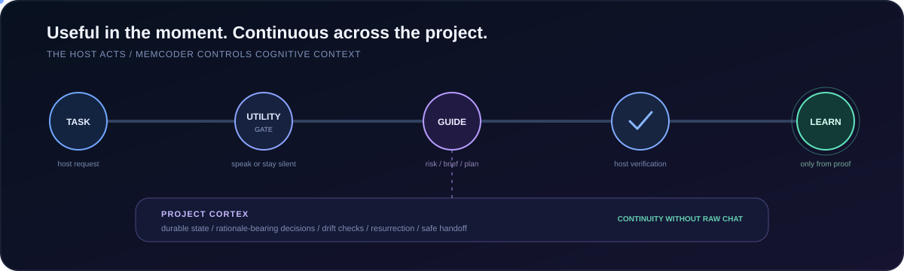
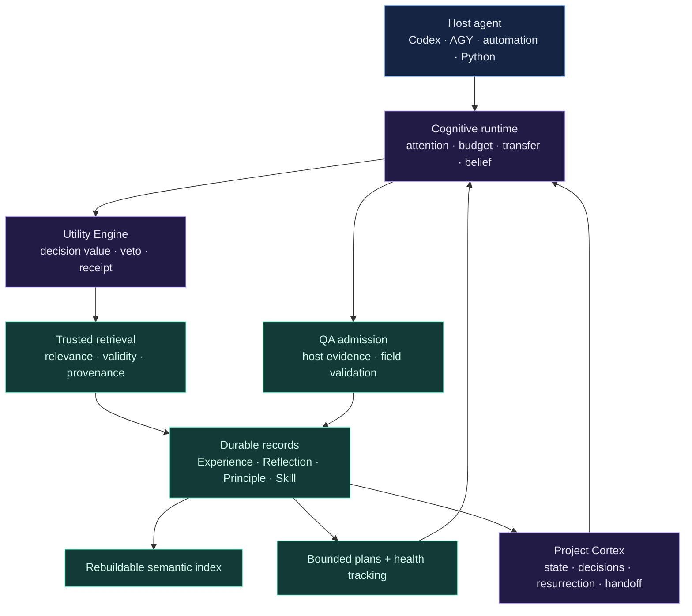

<div align="center">



<br />

<a href="https://pypi.org/project/memcoder/"></a>
<a href="https://pypi.org/project/memcoder/"></a>
<a href="LICENSE"></a>
<a href="docs/roadmap.md"></a>

### Memory is easy. Knowing what deserves to influence the next decision is harder.

**MemCoder is a local, provider-independent cognition layer for AI agents.**

It retrieves verified experience, suppresses low-utility guidance, preserves project decisions, and learns only from evidence.

<sub>Local-first · evidence-gated · utility-aware · token-bounded · host-agnostic</sub>

<br />

<a href="#start-in-60-seconds"><strong>Install</strong></a>
· <a href="#connect-a-host"><strong>Connect a host</strong></a>
· <a href="#beta-23-the-important-new-parts"><strong>Beta 2.3</strong></a>
· <a href="#trust-boundaries"><strong>Safety</strong></a>
· <a href="#architecture"><strong>Architecture</strong></a>
· <a href="docs/roadmap.md"><strong>Roadmap</strong></a>

</div>

---

<table>
<tr>
<td width="33%" valign="top">

### 01 / Remember proof

Store verified outcomes, not chat transcripts. Every durable Experience keeps its task, solution, files, and evidence.

</td>
<td width="33%" valign="top">

### 02 / Spend attention wisely

Return `none`, one risk, a compact brief, or a Skill-backed plan. Trusted-but-useless guidance is withheld.

</td>
<td width="34%" valign="top">

### 03 / Continue the project

Recover active state, constraints, decisions, rationale, risks, and next actions without replaying an entire conversation.

</td>
</tr>
</table>

> **MemCoder is not a bigger prompt and not a transcript archive.**
>
> It is a control plane for deciding what prior evidence should affect the current task.

## See it in one minute

<p align="center">
  
</p>

The host model still reads files, writes code, and runs tests. MemCoder does three narrower jobs:

1. **Before work:** decide whether previous evidence is useful enough to surface.
2. **After proof:** admit only verified learning into durable memory.
3. **Across sessions:** preserve bounded project state and rationale without storing raw chat.

If nothing is useful, MemCoder stays silent. If verification fails, MemCoder does not learn a success.

## Beta 2.3: the important new parts

Beta 2.3 adds two control systems above the original memory foundation.

### Utility Engine — relevance is necessary, not sufficient

Semantic similarity can retrieve something related that still does not help the next decision. The Utility Engine adds a second gate.

| New behavior | What it changes |
| --- | --- |
| **Decision framing** | Identifies the decision the host is actually trying to make, not only matching words. |
| **Utility veto** | Withholds evidence when its expected value does not justify distraction or token cost. |
| **Evidence diversity** | Avoids filling a packet with near-duplicate memories that all say the same thing. |
| **Intervention receipts** | Every surfaced packet gets an ID that can be audited and rated later. |
| **Outcome feedback** | `helpful`, `ignored`, `misleading`, and `harmful` ratings recalibrate future reuse. |
| **Retrieval diagnostics** | Shows semantic rank, utility rank, and the reason a candidate was withheld. |

The practical difference is restraint: a memory can be trusted and relevant yet still fail the utility gate.

### Project Cortex — continuity without conversational baggage

Project Cortex stores bounded, durable project cognition separately from task memories.

| Project state | Example |
| --- | --- |
| **Facts** | “The public API is Python 3.10+.” |
| **Constraints** | “The core runtime must remain provider-independent.” |
| **Goals** | “Prove utility on real repositories before production claims.” |
| **Decisions + rationale** | “Keep raw chat out of semantic memory because it is noisy and hard to validate.” |
| **Risks** | “Environment drift can invalidate an old implementation decision.” |
| **Next actions** | “Run the real-project evaluation protocol.” |

On resurrection, MemCoder checks the current environment against the saved one. Drift is reported rather than silently treating stale state as current truth. Handoffs export a bounded cognition capsule; the receiver must revalidate it before acceptance.

### What this means for a developer

```text
First task       solve normally → verify → record evidence
Related task     retrieve the smallest useful guidance → verify again
Long project     save decisions and state → resurrect with drift checks
Weak guidance    rate the exact receipt → reduce future interference
```

<details>
<summary><strong>Current capability matrix</strong></summary>

| Capability | Beta 2.3 status |
| --- | :---: |
| Persistent Experience, Principles, Reflections, and Mistakes | Ready |
| Confidence-, ownership-, validity-, environment-, and provenance-gated retrieval | Ready |
| `none` / `risk` / `brief` / `plan` intervention modes | Ready |
| Utility Engine, receipts, feedback, and retrieval diagnostics | Ready |
| Project state, decisions, resurrection, drift detection, and handoff | Ready |
| QA admission before durable learning | Ready |
| Skill promotion, planning, audit history, and health tracking | Ready |
| Provider-free core runtime | Ready |
| CLI, Python SDK, and MCP adapters | Ready |
| Codex Desktop local plugin | Local preview |
| Broad real-project causal evidence | In evaluation |

</details>

## Start in 60 seconds

### Option A — install the published beta

```powershell
python -m pip install --upgrade --pre memcoder
python -m memcoder --help
memcoder storage status
```

### Option B — install the newest source

Use this for Beta 2.3 development or the local Codex plugin:

```powershell
git clone https://github.com/Shikhar-code/memcoder.git
cd memcoder
python -m pip install --no-build-isolation .
python -m memcoder --help
```

**Requirements:** Python 3.10+. The first semantic-index run may download a local embedding model. The core runtime requires no model API key, Ollama, CUDA, or hosted LLM.

<details>
<summary><strong>Windows cannot find <code>python</code>?</strong></summary>

Install Python from [python.org](https://www.python.org/downloads/) and select **Add Python to PATH**. If your installation provides the Windows launcher, replace `python` with `py`.

</details>

## Connect a host

One cognition model, several integration boundaries. Choose the host you already use.

### Codex Desktop — automatic development cognition

The repository includes a local Codex plugin. Its Skill invokes MemCoder automatically for substantive engineering work and records learning only after focused verification passes.

```powershell
git clone https://github.com/Shikhar-code/memcoder.git
cd memcoder
python -m pip install --no-build-isolation .
python scripts/configure_codex_plugin.py
```

Then:

1. Open **Codex → Plugins**.
2. Add this repository's `codex-marketplace` directory as a local marketplace.
3. Install and enable **MemCoder**.
4. Restart Codex completely.
5. Start a normal coding task—no special MemCoder prompt is required.

To make the intervention visible while testing, ask:

```text
Before you begin, report whether MemCoder intervened and show its intervention mode.
```

The configuration script binds the plugin to the exact Python installation that contains MemCoder. Published Codex marketplace distribution is future work; the current integration is a local preview.

<details>
<summary><strong>AGY / Antigravity CLI</strong></summary>

Configure once and restart AGY:

```powershell
python -m memcoder setup-agy
```

For reliable manual use, separate cognition retrieval from execution.

**Message 1 — retrieve only**

```text
Do not read, list, edit, or run any files or commands.

Call memcoder_intervene exactly once with:
- problem: "<your exact task>"
- agent_id: "<stable project id>"
- include_shared: false

Print the complete result and stop.
```

**Message 2 — act and prove**

```text
Use the MemCoder packet returned immediately above as guidance, not proof.
Do not call another preparation tool.

Work only inside the current project. Make the smallest correct change, run
focused verification, and report the changed files and complete output.
```

See the full [AGY prompt template](docs/antigravity_prompt_template.md).

</details>

<details>
<summary><strong>Any CLI-capable automation</strong></summary>

Every cognition operation accepts JSON from a file or standard input and returns JSON.

`task.json`

```json
{
  "problem": "Fix request validation and run the focused test.",
  "agent_id": "billing-api",
  "include_shared": false,
  "token_budget": 450,
  "environment": {"branch": "main", "runtime": "python-3.12"}
}
```

```powershell
memcoder intervene --input task.json
```

After the host proves the result, submit structured evidence:

`outcome.json`

```json
{
  "task": "Fix required-field request validation.",
  "files": ["src/request.py", "tests/test_request.py"],
  "summary": "Missing values now raise the expected validation error.",
  "solution": "Validate presence and type before normalization.",
  "evidence": {
    "checks": [{
      "name": "focused request validation",
      "kind": "test",
      "status": "passed",
      "command": "python tests/test_request.py",
      "output": "PASS: request validation"
    }]
  },
  "agent_id": "billing-api"
}
```

```powershell
memcoder verify --input outcome.json
memcoder record --input outcome.json
```

`verify` is read-only. `record` repeats the QA gate and stores nothing when evidence is failed or insufficient.

</details>

<details>
<summary><strong>Python and MCP hosts</strong></summary>

```python
from memcoder import intervene_cognition

packet = intervene_cognition(
    problem="Fix request validation and run the focused test.",
    agent_id="billing-api",
    include_shared=False,
    token_budget=450,
)

print(packet["intervention"]["mode"])
```

MCP-capable hosts use the same operations through `adapters.mcp.server`. See the [MCP integration notes](docs/antigravity_mcp.md).

</details>

## Use the Beta 2.3 controls

### Inspect why retrieval did—or did not—intervene

```json
{
  "problem": "Fix request validation safely.",
  "agent_id": "billing-api",
  "include_shared": false,
  "environment": {"branch": "main"}
}
```

```powershell
memcoder retrieval-debug --input task.json
```

The result separates semantic rank from utility rank and explains withheld evidence.

### Rate one exact intervention

Use the `intervention_id` from a returned receipt:

```json
{
  "intervention_id": "<receipt id>",
  "rating": "helpful",
  "agent_id": "billing-api",
  "reason": "It changed the validation order and the hidden test passed.",
  "outcome": "Focused and hidden verification passed."
}
```

```powershell
memcoder utility-feedback --input feedback.json
```

Valid ratings are `helpful`, `ignored`, `misleading`, and `harmful`. Feedback is tied to the exact intervention, not a vague memory impression.

### Preserve and resurrect project cognition

`project-update.json`

```json
{
  "project_id": "billing-api",
  "agent_id": "billing-api",
  "environment": {"branch": "main", "runtime": "python-3.12"},
  "update": {
    "facts": ["Validation errors are part of the public API."],
    "constraints": ["Do not change successful response shapes."],
    "goals": ["Finish the validation hardening release."],
    "risks": ["Old guidance may predate the Python 3.12 migration."],
    "next_actions": ["Run the hidden validation matrix."],
    "decisions": [{
      "decision": "Validate before normalization.",
      "rationale": "It produces predictable exceptions for missing and wrong-type values.",
      "status": "active"
    }]
  }
}
```

```powershell
memcoder project-update --input project-update.json
memcoder project-resurrect --input project-resurrect.json
memcoder project-handoff --input project-handoff.json
memcoder project-accept --input project-accept.json
```

Resurrection is bounded by a token budget. Handoffs contain durable cognition, not unrestricted transcripts or secrets.

## How learning compounds

```text
verified Experience → Reflection → transferable Principle → promoted Skill → bounded Plan
```

| Layer | Contains | Never becomes |
| --- | --- | --- |
| **Experience** | Verified task, solution, files, and evidence | Raw conversation history |
| **Reflection** | Concise investigation observation from approved work | Unsupported self-critique |
| **Principle** | Transferable guidance backed by evidence | Generic advice |
| **Skill** | Procedure promoted from QA-approved support | Untested autonomous behavior |
| **Plan** | Bounded application of a trusted Skill | Open-ended permission |
| **Project Cortex** | Durable state, decisions, risks, and next actions | A transcript dump |

Checkpoints remain separate, bounded working state and never enter semantic guidance automatically.

<details>
<summary><strong>Skill lifecycle</strong></summary>

| Operation | Safety boundary |
| --- | --- |
| **Promote** | Requires two QA-approved Experiences, or one explicitly human-approved Experience. |
| **Retrieve** | Matching Skills rank ahead of isolated Experiences. |
| **Plan** | Every plan remains bounded and linked to its source Skill. |
| **Audit** | Plan outcomes remain audit history, not task guidance. |
| **Health** | Repeated failures can mark a Skill `review_required` and withhold it from reuse. |

```powershell
memcoder skill promote --input skill.json
memcoder start --input task.json
memcoder plan-history --input history.json
memcoder skill-health --input health.json
```

When no Skill matches, MemCoder says so. It does not manufacture expertise.

</details>

## Import project guidance

MemCoder can preview actionable Principles from `AGENTS.md`, runbooks, and architecture documents. Imported documentation never becomes Experience or Reflection because it is guidance—not lived, verified work.

```json
{
  "file_path": "AGENTS.md",
  "agent_id": "billing-api",
  "approve": false
}
```

Review the preview, then repeat with `approve: true`. Files must be UTF-8 Markdown inside the launched project and no larger than 1 MB. Prompt-injection patterns, placeholders, code blocks, and non-instructional prose are rejected.

## Trust boundaries

<table>
<tr>
<td width="50%" valign="top">

### Before guidance

- owner and shared-memory boundaries
- semantic relevance and confidence
- validity and contradiction state
- environment compatibility
- provenance and source proof
- decision utility and diversity

</td>
<td width="50%" valign="top">

### Before learning

- meaningful task and solution structure
- host-supplied verification evidence
- explicit pass or fail status
- inspectable command or reviewed assertion
- field-level rejection for weak learning
- no raw transcript ingestion

</td>
</tr>
</table>

Additional guarantees:

- **Local-first:** cognition stays on the user's machine by default.
- **Non-destructive:** contradiction and retention preserve original evidence.
- **Proof-carrying:** guidance retains source evidence and provenance.
- **Token-bounded:** intervention and resurrection expose explicit budgets.
- **Provider-free:** the core runtime is not coupled to a generation provider.

Set `MEMCODER_DB_PATH` to isolate a project or test database.

<details>
<summary><strong>Storage operations</strong></summary>

```powershell
memcoder storage status
memcoder storage migrate
memcoder storage rebuild-index
memcoder storage export --help
memcoder storage backup --help
memcoder storage restore --help
memcoder storage retention-preview --help
```

Durable records remain the source of truth; the semantic index can be rebuilt.

</details>

## Architecture



Read the [current architecture PDF](output/pdf/memcoder-current-architecture.pdf) for the component-level view.

## Evidence, honestly stated

In MemCoder's controlled transfer evaluation, three baseline AGY runs passed visible tests but failed private robustness checks. Six valid MemCoder-assisted runs passed the same private checks.

That supports a narrow claim: **verified validation procedures transferred to unseen variants in that controlled setup.** It does not prove universal agent improvement. Beta 2.3 remains a development release while real-project evaluations measure correctness, rework, token consumption, and tool use.

- [Controlled transfer results](docs/beta2_controlled_transfer_results.md)
- [Evaluation protocol](docs/beta2_evaluation_protocol.md)
- [Real-project evaluation protocol](docs/beta2_real_project_evaluation.md)

## Development

```powershell
python -m pip install --no-build-isolation .
python -m memcoder --help
```

Provider-free regression checks:

```powershell
python tests/test_automation_cli.py
python tests/test_mcp_provider_independence.py
python tests/test_retrieval_safety.py
python tests/test_memory_quality.py
python tests/test_qa_admission.py
python tests/test_cognition_brief.py
python tests/test_skill_promotion.py
python tests/test_planning.py
python tests/test_skill_health.py
python tests/test_evaluation.py
python tests/test_utility_engine.py
python tests/test_project_cortex.py
python tests/test_beta23_cli.py
```

## Documentation

| Document | Purpose |
| --- | --- |
| [Roadmap](docs/roadmap.md) | Product direction from Beta 2.3 to production. |
| [Changelog](CHANGELOG.md) | Release-facing changes and compatibility notes. |
| [Release checklist](docs/beta2_release_checklist.md) | Pre-release verification. |
| [AGY prompt template](docs/antigravity_prompt_template.md) | Guarded host workflow for AGY. |
| [MCP integration](docs/antigravity_mcp.md) | MCP behavior and provider-independence notes. |
| [Architecture PDF](output/pdf/memcoder-current-architecture.pdf) | Current component architecture. |

## What remains

Beta 2.3 implements the Utility Engine and Project Cortex foundations. The next defensible gate is not another feature count—it is broad evidence that automatic intervention improves real work without correctness, latency, or token regressions.

See the [full roadmap](docs/roadmap.md) for evaluation gates, deeper cognition, cloud synchronization, dreaming, and production hardening.

## License

Released under the [MIT License](LICENSE).

<div align="center">

### Retrieve precisely. Decide deliberately. Continue intelligently.

<sub>Built by <a href="https://github.com/Shikhar-code">Shikhar-code</a>.</sub>

</div>
