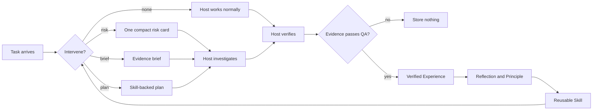

<div align="center">


<br />

<p>
  <a href="https://pypi.org/project/memcoder/"></a>
  <a href="https://pypi.org/project/memcoder/"></a>
  <a href="LICENSE"></a>
  <a href="docs/roadmap.md"></a>
  
  
</p>

### Memory that has to earn the right to influence the next task.

MemCoder is a provider-independent cognition layer for AI agents. It retrieves
relevant lessons from verified work, protects the agent from weak or stale
memory, and turns repeated success into reusable Skills and bounded plans.

<p>
  <a href="#quick-start"><strong>Quick start</strong></a>
  · <a href="#choose-your-host">Connect a host</a>
  · <a href="#the-cognition-loop">How it works</a>
  · <a href="#trust-by-design">Safety model</a>
  · <a href="docs/roadmap.md">Roadmap</a>
</p>

</div>

---

## Why MemCoder

Most agent memory systems optimize for storing more. MemCoder optimizes for
**reusing less, better evidence**.

<table>
<tr>
<td width="25%" valign="top">

### ◉ Attend

Decides whether memory should stay silent, surface one risk, return a brief, or
produce a Skill-backed plan.

</td>
<td width="25%" valign="top">

### ⌕ Retrieve

Filters by relevance, confidence, ownership, validity, environment, and
evidence quality before guidance reaches the host.

</td>
<td width="25%" valign="top">

### ✓ Verify

Requires host-supplied tests, builds, assertions, or reviewed evidence before
successful work becomes durable memory.

</td>
<td width="25%" valign="top">

### ↻ Reuse

Promotes repeated, QA-backed success into procedural Skills and bounded plans
with provenance and health tracking.

</td>
</tr>
</table>

> MemCoder does not replace the model, read your repository by itself, run
> commands, or decide that its own advice was correct. The host remains in
> control; MemCoder supplies compact cognition and admits learning only after
> verification.

## Quick start

### 1. Install

Install the latest published Beta from PyPI:

```powershell
python -m pip install --upgrade memcoder
python -m memcoder --help
```

The Beta 2.2 cognitive runtime and Codex plugin are currently on `main`. Until
the next PyPI pre-release is published, install them from this checkout:

```powershell
git clone https://github.com/Shikhar-code/memcoder.git
cd memcoder
python -m pip install --no-build-isolation .
```

Requirements: Python 3.10+ and internet access the first time the local
embedding model is downloaded. No API key, Ollama, CUDA, or local generation
server is required.

<details>
<summary><strong>Windows cannot find <code>python</code>?</strong></summary>

Install Python from [python.org](https://www.python.org/downloads/) and enable
**Add Python to PATH**. If your installation provides `py`, use `py` in place
of `python`.

</details>

### 2. Check the local store

```powershell
memcoder storage status
```

### 3. Connect a host

Choose Codex, AGY, MCP, the CLI, or the Python API below. The cognition model is
the same across every adapter.

## The cognition loop



```text
Experience → Reflection → Principle → Skill → Plan
```

1. **Intervene:** decide how much cognition is worth spending on this task.
2. **Retrieve:** return only trusted, relevant, owner-scoped evidence.
3. **Transfer:** separate what matches the current task from what still needs
   proof.
4. **Verify:** require the host to test or review the actual result.
5. **Learn:** store only outcomes admitted by the QA layer.

### Intervention modes

| Mode | Meaning | Host behavior |
| --- | --- | --- |
| `none` | No trusted memory is useful. | Solve normally. |
| `risk` | One known failure mode matters. | Check the risk before acting. |
| `brief` | Prior evidence can shorten investigation. | Use it as a hypothesis, not proof. |
| `plan` | A verified Skill matches. | Follow the bounded plan while assumptions hold. |

## Choose your host

### Codex desktop — automatic cognition

The repository contains a local Codex plugin under `codex-marketplace/`. It
bundles the MemCoder MCP server with a Skill that invokes cognition implicitly
for substantive development work.

1. Clone this repository and install the current source into your chosen Python
   environment:

   ```powershell
   git clone https://github.com/Shikhar-code/memcoder.git
   cd memcoder
   python -m pip install --no-build-isolation .
   ```

2. Bind the plugin to that exact Python:

   ```powershell
   python scripts/configure_codex_plugin.py
   ```

3. In Codex desktop, open **Plugins**, add the repository's
   `codex-marketplace` folder as a local marketplace, and install **MemCoder**.
4. Restart Codex completely.
5. Start a normal coding task. The plugin calls `memcoder_intervene` before
   substantive work and records only verified outcomes.

To confirm it is active, ask Codex:

```text
For this task, report whether MemCoder intervened and show its intervention
mode before you begin work.
```

The setup script prevents Codex from guessing which Python environment contains
MemCoder. The plugin is currently a local development integration; published
marketplace distribution remains future work. See the current
[Codex plugin bundle](codex-marketplace/plugins/memcoder/).

### AGY / Antigravity CLI

Configure AGY once, then restart it completely:

```powershell
python -m memcoder setup-agy
```

This exposes MCP tools including `memcoder_intervene`, `memcoder_prepare`,
`memcoder_start`, `memcoder_verify`, `memcoder_record`, and
`memcoder_promote_skill`.

<details open>
<summary><strong>Reliable two-message AGY workflow</strong></summary>

**Message 1 — retrieve only**

```text
Do not read, list, edit, or run any files or commands.

Call memcoder_prepare exactly once with:
- problem: "<your exact task>"
- agent_id: "my-project"
- include_shared: false

Print the complete result and stop.
```

**Message 2 — solve and verify**

```text
Use the MemCoder guidance returned immediately above as guidance, not proof.
Do not call any more MemCoder tools.

Work only inside the current project. Solve the task, run focused verification,
and report the changed files and complete verification output.
```

</details>

The production-ready version is in the
[AGY prompt template](docs/antigravity_prompt_template.md).

### Any CLI-capable automation

The CLI accepts JSON from a file or standard input and returns JSON, making it
the simplest provider-neutral integration boundary.

`intervene.json`

```json
{
  "problem": "Fix request validation and run the focused test.",
  "agent_id": "billing-api",
  "include_shared": false,
  "token_budget": 450
}
```

```powershell
memcoder intervene --input intervene.json
```

After the host verifies the result, submit structured evidence:

`outcome.json`

```json
{
  "task": "Fix required-field request validation.",
  "files": ["src/request.py", "tests/test_request.py"],
  "summary": "Missing values now raise the expected validation error.",
  "solution": "Validate presence and type before normalization.",
  "evidence": {
    "checks": [
      {
        "name": "focused request validation",
        "kind": "test",
        "status": "passed",
        "command": "python tests/test_request.py",
        "output": "PASS: request validation"
      }
    ]
  },
  "agent_id": "billing-api"
}
```

```powershell
memcoder verify --input outcome.json
memcoder record --input outcome.json
```

`verify` is read-only. `record` repeats the same QA gate and stores nothing when
evidence is failed or insufficient.

### Python and MCP hosts

Python integrations can use the public cognition API directly:

```python
from memcoder import intervene_cognition

packet = intervene_cognition(
    problem="Fix request validation and run the focused test.",
    agent_id="billing-api",
    include_shared=False,
    token_budget=450,
)

print(packet["intervention"]["mode"])
```

MCP-capable hosts use the same underlying operations through
`adapters.mcp.server`. See the [MCP notes](docs/antigravity_mcp.md).

## First run vs. later runs

| First verified task | Later related task |
| --- | --- |
| No trusted evidence may exist; `none` or `normal_reasoning` is expected. | Relevant approved Experiences may produce `risk` or `brief`. |
| The host solves and verifies normally. | MemCoder highlights the closest evidence and required proof. |
| Approved evidence creates the first Experience. | Repeated proof can support a Skill and bounded plan. |
| No verification means no learning. | Failed outcomes update health without becoming trusted guidance. |

Use a stable `agent_id` per project. It is a local memory namespace—not a model
provider account—and prevents unrelated work from mixing.

## Memory model

| Layer | What it stores | What it must not become |
| --- | --- | --- |
| **Experience** | A verified task, solution, files, and evidence. | A raw chat transcript. |
| **Reflection** | A concise observation derived from approved work. | Unsupported self-critique. |
| **Principle** | Transferable guidance backed by evidence. | A generic platitude. |
| **Skill** | A procedural workflow promoted from approved support. | An untested autonomous action. |

Plans are generated from trusted Skills. Checkpoints are separate bounded
working state and never enter semantic guidance memory automatically.

## Skills, plans, and health

| Operation | Safety boundary |
| --- | --- |
| **Promote** | Requires two QA-approved Experiences, or one explicitly human-approved Experience. |
| **Retrieve** | Matching Skills rank ahead of isolated Experiences. |
| **Plan** | Every plan is bounded and linked to its source Skill. |
| **Audit** | Plan outcomes remain audit history, not task guidance. |
| **Health** | Repeated failures can mark a Skill `review_required` and remove it from automatic reuse. |

```powershell
memcoder skill promote --input skill.json
memcoder start --input task.json
memcoder plan-history --input history.json
memcoder skill-health --input health.json
```

When no Skill matches, MemCoder says so. It does not manufacture expertise.

## Import project guidance

MemCoder can preview actionable Principles from an `AGENTS.md`, runbook, or
architecture document. Imported documentation never becomes Experience or
Reflection because it was not lived, verified work.

```json
{
  "file_path": "AGENTS.md",
  "agent_id": "billing-api",
  "approve": false
}
```

Review the preview, then repeat with `approve: true`. Files must be UTF-8
Markdown inside the launched project and no larger than 1 MB. Prompt-injection
patterns, placeholders, code blocks, and non-instructional prose are rejected.

## Trust by design

- **Local-first:** cognition is stored on the user's machine.
- **Owner-scoped:** memories are private to `agent_id` unless sharing is
  explicitly enabled.
- **Evidence-gated:** claims without passing verification do not become trusted
  Experience.
- **Retrieval-gated:** low-confidence, irrelevant, stale, contradicted, or
  environment-incompatible records are withheld.
- **Proof-carrying:** returned guidance retains source evidence and provenance.
- **Non-destructive:** contradiction and retention workflows preserve original
  evidence instead of silently deleting history.
- **Token-bounded:** cognition packets expose and respect an explicit budget.

Set `MEMCODER_DB_PATH` to isolate a project or test database.

### Storage operations

```powershell
memcoder storage status
memcoder storage migrate
memcoder storage rebuild-index
memcoder storage export --help
memcoder storage backup --help
memcoder storage restore --help
memcoder storage retention-preview --help
```

Durable records remain the source of truth; the semantic index can be rebuilt.

## Architecture

```text
Host (Codex / AGY / automation / Python)
                 │
                 ▼
        Cognitive Runtime
  attention · budget · transfer · belief
                 │
        ┌────────┴────────┐
        ▼                 ▼
 Retrieval + validity   QA admission
        │                 │
        └────────┬────────┘
                 ▼
   Durable records + provenance graph
                 │
                 ▼
       Rebuildable semantic index
```

Read the [architecture PDF](output/pdf/memcoder-current-architecture.pdf) for
the complete component view.

## Evidence and limits

In MemCoder's controlled transfer evaluation, three baseline AGY runs passed
visible tests but failed private robustness checks. Six valid MemCoder-assisted
runs passed the same private checks. This supports a narrow claim: verified
validation procedures transferred to unseen variants in that setup.

It does **not** prove universal agent improvement. Beta 2.2 remains a
development release while broader real-project evaluations measure correctness,
rework, token use, and tool use.

- [Controlled transfer results](docs/beta2_controlled_transfer_results.md)
- [Evaluation protocol](docs/beta2_evaluation_protocol.md)
- [Real-project evaluation protocol](docs/beta2_real_project_evaluation.md)

## Development

```powershell
python -m pip install --no-build-isolation .
python -m memcoder --help
```

Run the provider-free regression checks:

```powershell
python tests/test_automation_cli.py
python tests/test_mcp_provider_independence.py
python tests/test_retrieval_safety.py
python tests/test_memory_quality.py
python tests/test_qa_admission.py
python tests/test_cognition_brief.py
python tests/test_skill_promotion.py
python tests/test_planning.py
python tests/test_skill_health.py
python tests/test_evaluation.py
python tests/test_cognitive_runtime.py
```

## Documentation

| Document | Purpose |
| --- | --- |
| [Roadmap](docs/roadmap.md) | Product direction from Beta 2.2 through production. |
| [Changelog](CHANGELOG.md) | Release-facing changes and compatibility notes. |
| [Release checklist](docs/beta2_release_checklist.md) | Pre-commit and release verification. |
| [AGY prompt template](docs/antigravity_prompt_template.md) | Guarded host workflow for AGY. |
| [MCP integration](docs/antigravity_mcp.md) | MCP behavior and provider-independence notes. |
| [Architecture PDF](output/pdf/memcoder-current-architecture.pdf) | Current system architecture. |

## Project status

MemCoder is under active Beta-2 development. The provider-free memory, QA,
Skill, planning, validity, provenance, and first cognitive-runtime vertical
slice are implemented. The next release gate is broader evidence that automatic
intervention improves real work without correctness or token regressions.

Follow the [full roadmap](docs/roadmap.md).

## License

Released under the [MIT License](LICENSE).

<div align="center">

**Retrieve precisely. Verify relentlessly. Reuse only what proved itself.**

<sub>Built by <a href="https://github.com/Shikhar-code">Shikhar-code</a>.</sub>

</div>
