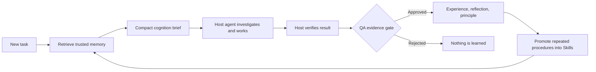

<div align="center">

# MemCoder


<p>
  <a href="https://pypi.org/project/memcoder/"></a>
  <a href="https://pypi.org/project/memcoder/"></a>
  <a href="LICENSE"></a>
  <a href="docs/roadmap.md"></a>
</p>

<p>
  <a href="#quick-start">Quick start</a> ·
  <a href="#how-it-works">How it works</a> ·
  <a href="#agy--antigravity-cli">AGY setup</a> ·
  <a href="#skills-and-plans">Skills & plans</a> ·
  <a href="#evidence-and-limitations">Evidence</a>
</p>

</div>

> **MemCoder is a local, provider-independent cognition layer for AI agents.**
> It preserves verified lessons from past work, retrieves only relevant trusted
> guidance for a new task, promotes repeatable procedures into Skills, and
> returns bounded plans—without taking over your model, tools, codebase, or
> database.

## Why MemCoder?

Most agent hosts start every task with no durable, verified knowledge of what
worked before. MemCoder gives them a memory loop that stays grounded in actual
evidence:



MemCoder supplies **guidance, not proof**. The host agent still reasons, edits,
tests, renders, deploys, and decides what to do.

| MemCoder owns | Your host owns |
| --- | --- |
| Local memory, retrieval, quality gates, Skills, plans, audit trails | Model choice, reasoning, tools, code changes, tests, deployment, project data |

## What it can do today

| Capability | What it means |
| --- | --- |
| **Persistent memory** | Stores Experiences, Mistakes, Reflections, and Principles locally, scoped by `agent_id`. |
| **Precision retrieval** | Confidence and lexical relevance gates prevent weak or unrelated memory from being injected. |
| **Compact briefs** | Returns a bounded decision brief instead of dumping an entire memory store into context. |
| **QA-gated learning** | Accepts durable Experiences only when host-supplied verification evidence is approved. |
| **Traceable reflection** | Links accepted reflections back to their approved source Experience. |
| **Skills** | Promotes a reusable procedure only from QA-backed Experience evidence. |
| **Bounded plans** | Produces a transparent plan from a matching Skill, or an explicit foundation plan when no Skill exists. |
| **Skill health** | Tracks audited outcomes and removes repeatedly failing Skills from automatic retrieval. |
| **Host independence** | Works through MCP, CLI, or Python—without Ollama, CUDA, a local generation server, or an API key. |
| **Instruction import** | Previews and imports approved actionable principles from project Markdown files. |
| **Evaluation** | Compares baseline, memory-guided, and skill-planned agent runs without pretending correlation is proof. |

## How it works

MemCoder is deliberately modular. It does not require a specific AI provider;
any host that can make an MCP call or run a command can use it.

```text
Experience → Reflection → Principle → Skill → Plan
```

1. Before work, the host asks MemCoder for relevant memory.
2. MemCoder returns a compact brief, and optionally a Skill-backed plan.
3. The host solves and independently verifies the task.
4. MemCoder QA-checks the supplied evidence before storing anything.
5. Repeated verified Experiences can support a promoted Skill.

## Quick start

### 1. Install

**Requirements:** Python 3.10+ and internet access on first retrieval to obtain
the local embedding model. No API key is required.

<details open>
<summary><strong>Windows PowerShell</strong></summary>

```powershell
python -m pip install --upgrade memcoder
python -m memcoder --help
```

</details>

<details>
<summary><strong>macOS / Linux</strong></summary>

```bash
python3 -m pip install --upgrade memcoder
python3 -m memcoder --help
```

</details>

If Windows cannot find `python`, install it from [python.org](https://www.python.org/downloads/), selecting **Add Python to PATH**. Use `py` instead of `python` if that is how your installation is configured.

For development from a cloned checkout:

```powershell
python -m pip install --no-build-isolation .
```

### 2. Retrieve guidance before work

Create `prepare.json` in the project that your agent will work on:

```json
{
  "problem": "Resolve a required-field validation failure and run the focused test.",
  "agent_id": "billing-api",
  "include_shared": false,
  "detail_level": "brief"
}
```

```bash
memcoder prepare --input prepare.json
```

The response includes a strategy (`normal_reasoning`, `memory_guided`, or
`memory_first`), a compact evidence brief, the next recommended action, and a
token estimate. Give that brief to the host as investigation guidance.

> `agent_id` is simply a stable memory namespace—use one label per project,
> such as `billing-api` or `lesson-video-pipeline`, and reuse it across tasks.

### 3. Verify, then learn

After the host's test, build, render, or other acceptance check succeeds,
prepare an evidence-backed outcome:

```json
{
  "task": "Resolved a required-field validation failure.",
  "files": ["src/request_validation.py", "tests/test_request_validation.py"],
  "summary": "The focused test passed after explicit validation was added.",
  "solution": "Validated the required field before processing the request.",
  "evidence": {
    "checks": [
      {
        "name": "focused request-validation test",
        "kind": "test",
        "status": "passed",
        "command": "python tests/test_request_validation.py",
        "output": "PASS: request validation"
      }
    ]
  },
  "reflection": "I reproduced the missing-field case before changing validation.",
  "principles": ["Validate required fields before processing input."],
  "agent_id": "billing-api"
}
```

Preview the evidence verdict, then store it only if it is approved:

```bash
memcoder verify --input record.json
memcoder record --input record.json
```

If evidence is missing or a check fails, MemCoder returns `insufficient_evidence`
or `rejected` and does not create durable learning.

### First task vs. later tasks

On a new project, no memory is expected—`normal_reasoning` is correct. After
the first verified outcome is recorded, similar later tasks can receive
`memory_guided` or `memory_first` support. MemCoder improves through verified
work, not by saving every conversation.

## AGY / Antigravity CLI

MemCoder exposes an MCP server for AGY. One command configures it without
changing your other MCP servers.

```bash
python -m memcoder setup-agy
```

Fully restart AGY afterward. You should then see tools including:

`memcoder_prepare` · `memcoder_start` · `memcoder_verify` · `memcoder_record` · `memcoder_promote_skill` · `memcoder_plan_history`

No Ollama installation, model server, API key, or `agy plugin install` command
is required.

### Reliable AGY workflow

For deterministic tool use, make retrieval a dedicated first message rather
than hoping the host decides to call it midway through a longer prompt.

**Message 1 — retrieve only**

```text
Do not read, list, edit, or run any files or commands.

Call memcoder_prepare exactly once with:
- problem: "<your exact task>"
- agent_id: "my-project"
- include_shared: false

After the tool returns, print the complete result and stop.
```

**Message 2 — perform the task**

```text
Use the MemCoder guidance returned immediately above as guidance, not proof.
Do not call any more MemCoder tools.

Work only inside the current folder. Do not inspect or edit MemCoder itself.
Solve the requested task, run its focused verification, and report the changed
files and complete test output.
```

After a successful task, call `memcoder_verify` with the actual evidence, then
call `memcoder_record` exactly once only when QA approves it. See the stricter
[AGY prompt template](docs/antigravity_prompt_template.md) for a reusable
version.

If AGY cannot see the tools:

```bash
python -c "from adapters.mcp.server import mcp; print('MemCoder MCP import OK')"
```

Then reinstall MemCoder in the same Python environment used for `setup-agy` and
restart AGY.

## Skills and plans

### Promote a Skill from verified work

A Skill is a traceable procedure, not a free-form note. Promotion requires at
least two QA-approved Experiences, or one QA-approved Experience explicitly
marked `human_approved`.

```json
{
  "name": "Required field validation",
  "when_to_use": "A request may omit a required field before processing.",
  "inputs": ["request payload", "required field name"],
  "steps": [
    "Read the required value without string operations.",
    "Reject missing, null, whitespace-only, or non-string values with the expected error.",
    "Normalize only after validation.",
    "Run the focused test."
  ],
  "verification": ["The focused validation test passes."],
  "supporting_experience_ids": ["experience-id-one", "experience-id-two"],
  "agent_id": "billing-api"
}
```

```bash
memcoder skill promote --input skill.json
```

### Ask for a plan

```json
{
  "problem": "A required request field may be missing before processing.",
  "agent_id": "billing-api",
  "include_shared": false
}
```

```bash
memcoder start --input plan.json
```

`start` makes one retrieval and returns both a compact brief and a bounded
plan. When a matching QA-backed Skill exists, the plan names its source Skill;
otherwise MemCoder clearly returns a foundation plan rather than pretending it
has learned a procedure.

Every plan has a stable ID. Record a post-task outcome with that ID to create a
durable audit trail; plan audits are never retrieved as task guidance. Inspect
them with:

```bash
memcoder plan-history --input plan-history.json
memcoder skill-health --input skill-health.json
```

## Bring existing instructions forward

Use Markdown import for an `AGENTS.md`, runbook, architecture guide, or other
project instruction file. MemCoder extracts actionable guidance as candidate
Principles—it does **not** treat the document as an Experience or Reflection.

From an MCP host, preview first:

```json
{
  "file_path": "AGENTS.md",
  "agent_id": "billing-api",
  "approve": false
}
```

Review candidates, then call again with `"approve": true` to store approved
Principles. Files must be UTF-8 Markdown, inside the launched project, and at
most 1 MB. Code blocks, feature descriptions, placeholders, and common
instruction-injection patterns are rejected.

## Evidence and limitations

MemCoder includes an evaluation command for matched baseline, memory-guided,
and skill-planned runs:

```bash
memcoder evaluate --input evaluation.json
```

The first controlled transfer evaluation found that three baseline AGY runs
passed visible tests but failed private robustness checks, while six valid
MemCoder-assisted runs passed their private checks. Read the full methodology,
results, and limitations in [Beta 2 controlled transfer results](docs/beta2_controlled_transfer_results.md).

This is promising, deliberately narrow evidence—not proof of universal coding
improvement. The [real-project evaluation protocol](docs/beta2_real_project_evaluation.md)
defines what broader Beta 2 evidence requires.

## Privacy and local storage

Memory is stored locally in ChromaDB. By default, MemCoder uses the package or
checkout `chroma_db` directory. Set `MEMCODER_DB_PATH` before running MemCoder
to use an isolated database.

Records are owner-scoped with `agent_id`; they are not synchronized to a cloud
account or shared with a team by default.

## Optional legacy Ollama helpers

The old `solve()` and `learn()` helpers are not part of the current provider-free
workflow. Install their optional dependency only if you intentionally need them:

```bash
python -m pip install "memcoder[ollama]"
```

## Contributing and verification

From a local checkout, run the provider-free checks:

```bash
python tests/test_automation_cli.py
python tests/test_mcp_provider_independence.py
python tests/test_retrieval_safety.py
python tests/test_retrieval_calibration.py
python tests/test_memory_quality.py
python tests/test_qa_admission.py
python tests/test_cognition_brief.py
python tests/test_skill_promotion.py
python tests/test_skill_learning_proof.py
python tests/test_planning.py
python tests/test_plan_outcomes.py
python tests/test_skill_health.py
python tests/test_evaluation.py
```

## Roadmap

See the [roadmap](docs/roadmap.md) for the path through later Beta 2 work,
multi-agent cognition, a Memory Studio GUI, and production readiness.

## License

Released under the [MIT License](LICENSE).
