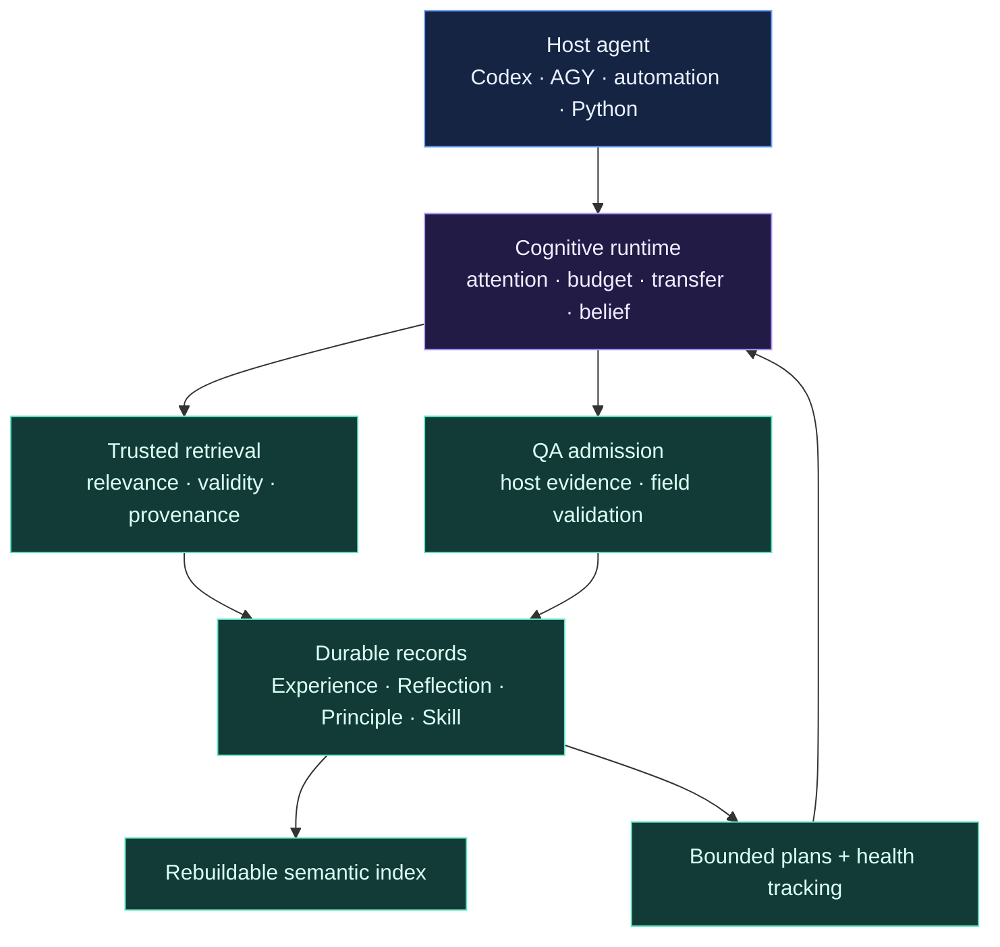

<div align="center">


<br />

<a href="https://pypi.org/project/memcoder/"></a>
<a href="https://pypi.org/project/memcoder/"></a>
<a href="LICENSE"></a>
<a href="docs/roadmap.md"></a>

### Give an agent memory. Make that memory prove it deserves to be used.

**MemCoder is a provider-independent cognition layer that turns verified work into precise, reusable guidance for AI agents.**

<sub>Local-first · evidence-gated · token-bounded · host-agnostic</sub>

<br />

<a href="#quick-start"><strong>Quick start</strong></a>
· <a href="#connect-your-agent"><strong>Connect an agent</strong></a>
· <a href="#how-cognition-compounds"><strong>How it learns</strong></a>
· <a href="#trust-is-the-product"><strong>Trust model</strong></a>
· <a href="docs/roadmap.md"><strong>Roadmap</strong></a>

</div>

---

<table>
<tr>
<td width="33%" valign="top">

### 01 / Retrieve less

MemCoder filters by relevance, confidence, ownership, validity, environment,
and provenance before a memory can influence the host.

</td>
<td width="33%" valign="top">

### 02 / Prove first

Tests, builds, assertions, or reviewed evidence must pass before successful
work becomes durable cognition.

</td>
<td width="34%" valign="top">

### 03 / Compound wins

Repeated verified outcomes can become Principles, procedural Skills, and
bounded plans that shorten later work.

</td>
</tr>
</table>

> **Most memory systems ask: “What can we store?”**
>
> **MemCoder asks: “What has earned the right to influence the next task?”**

## The 60-second mental model

<p align="center">
  
</p>

A task reaches the host. MemCoder decides whether prior evidence is useful. If
it is not, MemCoder stays silent. If it is, the host receives the smallest
useful packet: one risk, a compact brief, or a Skill-backed plan. The host still
investigates and verifies the result. Only passing evidence may become memory.

```text
Task → Attend → Retrieve → Host acts → Verify → Learn
```

MemCoder does **not** replace the model, inspect a repository by itself, run
commands, or declare its own advice correct. It supplies cognition; the host
keeps control.

## What ships in Beta 2.2

| Capability | What is working now | Status |
| --- | --- | :---: |
| **Persistent Experience** | Verified task outcomes survive across sessions. | Ready |
| **Precision retrieval** | Confidence, ownership, validity, environment, and provenance gates suppress weak matches. | Ready |
| **Cognitive intervention** | `none`, `risk`, `brief`, and `plan` modes spend attention proportionally. | Ready |
| **QA admission** | Unsupported or failed outcomes cannot become trusted Experience. | Ready |
| **Principles and Reflections** | Structured learning is derived from approved work rather than raw chat. | Ready |
| **Skills and plans** | Repeated QA-backed success can become reusable procedures with health tracking. | Ready |
| **Provider independence** | Core cognition requires no hosted LLM, Ollama, CUDA, or model API key. | Ready |
| **Codex Desktop integration** | Local plugin invokes cognition implicitly during substantive development work. | Local preview |
| **AGY, CLI, Python, and MCP** | Multiple adapters expose the same cognition model. | Ready |

## Quick start

### Install from PyPI

```powershell
python -m pip install --upgrade --pre memcoder
python -m memcoder --help
memcoder storage status
```

### Install the current source

Use this path when testing the newest Beta 2.2 code or the local Codex plugin:

```powershell
git clone https://github.com/Shikhar-code/memcoder.git
cd memcoder
python -m pip install --no-build-isolation .
python -m memcoder --help
```

**Requirements:** Python 3.10+ and internet access the first time the local
embedding model is downloaded. No API key, Ollama, CUDA, or local generation
server is required.

<details>
<summary><strong>Windows cannot find <code>python</code>?</strong></summary>

Install Python from [python.org](https://www.python.org/downloads/) and enable
**Add Python to PATH**. If your installation provides `py`, use `py` instead
of `python` in the commands above.

</details>

## Connect your agent

The cognition model stays the same across every adapter. Choose the host that
matches your workflow.

<details open>
<summary><strong>Codex Desktop — automatic cognition</strong></summary>

The repository includes a local Codex plugin under `codex-marketplace/`. Its
Skill invokes MemCoder automatically before substantive engineering work and
records learning only after focused verification passes.

1. Clone and install the current source:

   ```powershell
   git clone https://github.com/Shikhar-code/memcoder.git
   cd memcoder
   python -m pip install --no-build-isolation .
   ```

2. Bind the plugin to that exact Python installation:

   ```powershell
   python scripts/configure_codex_plugin.py
   ```

3. In Codex Desktop, open **Plugins**, add this repository's
   `codex-marketplace` folder as a local marketplace, and install **MemCoder**.
4. Restart Codex completely.
5. Start a normal coding task. No special MemCoder prompt is required.

To confirm that it is active, ask:

```text
Before you begin, report whether MemCoder intervened and show its intervention mode.
```

The configuration script prevents Codex from guessing which Python environment
contains MemCoder. Published marketplace distribution remains future work.

</details>

<details>
<summary><strong>AGY / Antigravity CLI</strong></summary>

Configure AGY once, then restart it completely:

```powershell
python -m memcoder setup-agy
```

This exposes tools such as `memcoder_intervene`, `memcoder_prepare`,
`memcoder_start`, `memcoder_verify`, `memcoder_record`, and
`memcoder_promote_skill`.

For reliable manual use, separate retrieval from execution:

**Message 1 — retrieve only**

```text
Do not read, list, edit, or run any files or commands.

Call memcoder_prepare exactly once with:
- problem: "<your exact task>"
- agent_id: "my-project"
- include_shared: false

Print the complete result and stop.
```

**Message 2 — solve and verify**

```text
Use the MemCoder guidance returned immediately above as guidance, not proof.
Do not call any more MemCoder tools.

Work only inside the current project. Solve the task, run focused verification,
and report the changed files and complete verification output.
```

See the complete [AGY prompt template](docs/antigravity_prompt_template.md).

</details>

<details>
<summary><strong>Any CLI-capable automation</strong></summary>

The CLI accepts JSON from a file or standard input and returns JSON, providing
a small provider-neutral integration boundary.

`intervene.json`

```json
{
  "problem": "Fix request validation and run the focused test.",
  "agent_id": "billing-api",
  "include_shared": false,
  "token_budget": 450
}
```

```powershell
memcoder intervene --input intervene.json
```

After the host verifies the result, submit structured evidence:

`outcome.json`

```json
{
  "task": "Fix required-field request validation.",
  "files": ["src/request.py", "tests/test_request.py"],
  "summary": "Missing values now raise the expected validation error.",
  "solution": "Validate presence and type before normalization.",
  "evidence": {
    "checks": [{
      "name": "focused request validation",
      "kind": "test",
      "status": "passed",
      "command": "python tests/test_request.py",
      "output": "PASS: request validation"
    }]
  },
  "agent_id": "billing-api"
}
```

```powershell
memcoder verify --input outcome.json
memcoder record --input outcome.json
```

`verify` is read-only. `record` repeats the QA gate and stores nothing when
evidence is failed or insufficient.

</details>

<details>
<summary><strong>Python and MCP hosts</strong></summary>

Python integrations can use the cognition API directly:

```python
from memcoder import intervene_cognition

packet = intervene_cognition(
    problem="Fix request validation and run the focused test.",
    agent_id="billing-api",
    include_shared=False,
    token_budget=450,
)

print(packet["intervention"]["mode"])
```

MCP-capable hosts use the same operations through `adapters.mcp.server`. See
the [MCP integration notes](docs/antigravity_mcp.md).

</details>

## First run versus later runs

| First verified task | Later related task |
| --- | --- |
| No trusted evidence may exist; `none` is expected. | Approved Experience may produce `risk` or `brief`. |
| The host solves and verifies normally. | MemCoder points to the closest evidence and required proof. |
| Passing evidence creates the first Experience. | Repeated proof can support a Skill and bounded plan. |
| No verification means no learning. | Failed outcomes affect health without becoming trusted guidance. |

Use a stable `agent_id` for each project. It is a local memory namespace—not a
model-provider account—and prevents unrelated work from mixing.

## How cognition compounds

```text
Experience → Reflection → Principle → Skill → Plan
```

| Layer | What it contains | What it must never become |
| --- | --- | --- |
| **Experience** | A verified task, solution, files, and evidence. | A raw conversation transcript. |
| **Reflection** | A concise investigation observation from approved work. | Unsupported self-critique. |
| **Principle** | Transferable guidance backed by evidence. | A generic platitude. |
| **Skill** | A procedure promoted from approved support. | An untested autonomous action. |
| **Plan** | A bounded application of a trusted Skill. | An open-ended permission slip. |

Checkpoints are separate, bounded working state. They never enter semantic
guidance memory automatically.

### Skill lifecycle

| Operation | Safety boundary |
| --- | --- |
| **Promote** | Requires two QA-approved Experiences, or one explicitly human-approved Experience. |
| **Retrieve** | Matching Skills rank ahead of isolated Experiences. |
| **Plan** | Every plan remains bounded and linked to its source Skill. |
| **Audit** | Plan outcomes remain audit history, not task guidance. |
| **Health** | Repeated failures can mark a Skill `review_required` and withhold it from reuse. |

```powershell
memcoder skill promote --input skill.json
memcoder start --input task.json
memcoder plan-history --input history.json
memcoder skill-health --input health.json
```

When no Skill matches, MemCoder says so. It does not manufacture expertise.

## Import project guidance

MemCoder can preview actionable Principles from `AGENTS.md`, runbooks, and
architecture documents. Imported documentation never becomes Experience or
Reflection because it is guidance—not lived, verified work.

```json
{
  "file_path": "AGENTS.md",
  "agent_id": "billing-api",
  "approve": false
}
```

Review the preview, then repeat with `approve: true`. Files must be UTF-8
Markdown inside the launched project and no larger than 1 MB. Prompt-injection
patterns, placeholders, code blocks, and non-instructional prose are rejected.

## Trust is the product

<table>
<tr>
<td width="50%" valign="top">

### Before retrieval

- Owner and shared-memory boundaries
- Relevance and confidence calibration
- Validity and contradiction state
- Environment compatibility
- Source provenance and proof

</td>
<td width="50%" valign="top">

### Before learning

- Meaningful task and solution structure
- Host-supplied verification evidence
- Explicit pass or fail status
- Inspectable command or reviewed assertion
- Field-level rejection for weak learning

</td>
</tr>
</table>

Additional guarantees:

- **Local-first:** cognition stays on the user's machine by default.
- **Non-destructive:** contradiction and retention preserve original evidence.
- **Proof-carrying:** guidance retains source evidence and provenance.
- **Token-bounded:** intervention exposes and respects a cognition budget.
- **Provider-free:** the core runtime is not coupled to a generation provider.

Set `MEMCODER_DB_PATH` to isolate a project or test database.

### Storage operations

```powershell
memcoder storage status
memcoder storage migrate
memcoder storage rebuild-index
memcoder storage export --help
memcoder storage backup --help
memcoder storage restore --help
memcoder storage retention-preview --help
```

Durable records remain the source of truth; the semantic index can be rebuilt.

## Architecture



For the full component view, read the
[current architecture PDF](output/pdf/memcoder-current-architecture.pdf).

## Evidence, honestly stated

In MemCoder's controlled transfer evaluation, three baseline AGY runs passed
visible tests but failed private robustness checks. Six valid MemCoder-assisted
runs passed the same private checks.

That supports a narrow claim: **verified validation procedures transferred to
unseen variants in that controlled setup.** It does not prove universal agent
improvement. Beta 2.2 remains a development release while broader real-project
evaluations measure correctness, rework, token consumption, and tool use.

- [Controlled transfer results](docs/beta2_controlled_transfer_results.md)
- [Evaluation protocol](docs/beta2_evaluation_protocol.md)
- [Real-project evaluation protocol](docs/beta2_real_project_evaluation.md)

## Development

```powershell
python -m pip install --no-build-isolation .
python -m memcoder --help
```

Run the provider-free regression checks:

```powershell
python tests/test_automation_cli.py
python tests/test_mcp_provider_independence.py
python tests/test_retrieval_safety.py
python tests/test_memory_quality.py
python tests/test_qa_admission.py
python tests/test_cognition_brief.py
python tests/test_skill_promotion.py
python tests/test_planning.py
python tests/test_skill_health.py
python tests/test_evaluation.py
python tests/test_cognitive_runtime.py
```

## Documentation

| Document | Purpose |
| --- | --- |
| [Roadmap](docs/roadmap.md) | Product direction from Beta 2.2 through production. |
| [Changelog](CHANGELOG.md) | Release-facing changes and compatibility notes. |
| [Release checklist](docs/beta2_release_checklist.md) | Pre-release verification. |
| [AGY prompt template](docs/antigravity_prompt_template.md) | Guarded host workflow for AGY. |
| [MCP integration](docs/antigravity_mcp.md) | MCP behavior and provider-independence notes. |
| [Architecture PDF](output/pdf/memcoder-current-architecture.pdf) | Current component architecture. |

## Road ahead

The provider-free memory, QA, Skill, planning, validity, provenance, and first
cognitive-runtime vertical slice are implemented. The next release gate is
broader evidence that automatic intervention improves real work without
correctness or token regressions.

Follow the [full roadmap](docs/roadmap.md).

## License

Released under the [MIT License](LICENSE).

<div align="center">

### Retrieve precisely. Verify relentlessly. Compound what works.

<sub>Built by <a href="https://github.com/Shikhar-code">Shikhar-code</a>.</sub>

</div>
